# FINAL REPORT: Deploying an Accurate Classifier to Stop Online Violence Against Children using NLP.

## A project by the Omdena Marseille Local Chapter.

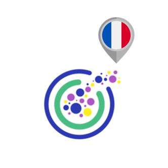

_____________________________________________

# Executive Summary

'Deploying an Accurate Classifier to Stop Online Violence Against Children using NLP', a project by the Omdena Marseille Local Chapter led by chapter leader Alexandre Iang, lasted 8 weeks and saw the cooperation of an international team of 12 AI engineers. These cooperated steadily to define the problem, collect sentence that fall into the category of 'hate' from social media, pre-process and annotate them, create a ML algorithm for their classification on the basis of pre-defined labels, and eventually deploy a POC of the model in Streamlit. The project, which run smoothly and was completed successfully, will be followed by a follow-up chapter which will aim at improving both the model and the way the model is deployed.

# Introduction

This challenge was created to deploy an accurate classifier to identify grooming behavior in online chats with children. Its main aim was to stop online violence against children. The challenge, which united an international team of AI engineers over 8-weeks, was led by chapter lead Alexandre Iang. 

The common language for the chapter was English, although all chapter work was done on French data. Most engineers had at least a working knowledge of French. Platforms such as GitHub, Notion, Trello, and a dedicated Slack channed were used to coordinate and keep track of the engineer's work.

## Problem Statement

The project was designed to reduce Online Sexual Exploitation and Abuse of Children (OSEAC). With a 15,000% rise in online Child Sexual Abuse Materials (CSAM) online from 2005 to 2020, it is clear that online child violence is growing exponentially. In 2021, the National Center for Missing and Exploited Children’s CyberTipline received 29.3 million reports of CSAM, making 2021 the worst year on record for online child sexual abuse.

Online grooming is the primary way that adults with a sexual interest in children or those who wish to harm them utilise to approach their preys ([1], [2]).

“Grooming is a multidimensional phenomenon in which an adult aims to solicit a child into a seemingly voluntary interaction with the intention of sexually abusing that child.” In a study Save the Children published last year, Grooming in the Eyes of a Child ([3]), we found that children who are the object of grooming often do not realize what is happening so they do not recognize they are in danger until they are being extorted into providing increasingly harmful imagery or even to meeting an online predator in person.

### Previous Related Work on the Topic

In 2020, Save the Children US collaborated with Omdena to address online violence. Of the various products that were generated from the sprint, the most promising was a classifier algorithm using Natural Language Programming to identify online grooming combined with a chatbot that can warn the children that they may be chatting with a groomer. Since then, a team of three engineers associated with the original project has continued to refine the technology. The core team now wants to expand on the work to build an industry usable solution at scale.

From the original challenge, the team has a large dataset of more than 800,000 lines taken from the Perverted Justice project, a project from 2003 to 2019 that used online volunteers as decoys to entrap predators that sought to contact minors to obtain sexual images or videos from them or to meet them in person. During the challenge and afterward, the team tagged much of the training data with labels, such as male or female, predator or victim, and level of risk of the conversation, but the data still requires extensive processing, and in particular, the team need to improve and systematize the way judge and annotate the level of risk. In addition to the data already have, the team is actively attempting to obtain additional databases of online grooming chats from a variety of sources, such as law enforcement agencies.

## Project Goals

The team goal was to stop online violence against children by deploying an accurate classifier to identify grooming behavior in online chats with children. Once suspicion of grooming reaches a threshold based on its similarity to the training data, it will trigger an action, which may differ depending on the platform it is deployed on and the objectives of the intervention. As an example, the team may warn the child through the chatbot without alerting the groomer, call a moderator, or shut down the chat entirely.

# Our Solution

For this challenge, we decided to collect additional data on hate speech from the Internet, classify them using five labels related to the field of 'hate', and then clean the data and use it to fine-tune a pre-existing language model.

## Domain Research

The first days of the project were dedicated to the onboarding, and to the definition of the materials to be used by the engineers to acquire domain knowledge.

At this early stage, different classes of hate were identified. Five among the most important classes of hate were defined as followed:

- *Sexism*: Refers to acts of violence that: 1) occur or linger in cyberspace; 2) are sexist, or sexual in nature; and 3) who reiterates dominant gender norms targeting girls and boys (tarnishing the former’s reputation and threatening the latter’s masculinity);

- *Racism*: Cyber racism  is  most  commonly  defined   as  racism  which   occurs  in   the  cyber world. This   includes   racism   which   occurs   on   the   internet   such   as   racist   websites, images, blogs, videos and online comments as well as racist comments, images or language in text messages, emails or on social networking sites. It can be defined more broadly as any use of information and communication technologies to   transmit   racist   attitudes   and   behaviour   including   the   transfer   of   racially offensive content that is intended to cause harm or distress to another person [4];

- *Homophobia*: Sexual   minorities   often   make   greater   use   of   the   internet   to   look   for   specific socialization environments in which they can meet other people with the same orientation or can avoid face-to-face social rejection and homophobic bullying. Paradoxically,   this   greater   use   of   the   internet  to   escape   offline   discrimination could lead to greater exposure to OSVR (Online Sexual Victimization and Risks). The   internet   is   an   environment   that   reproduces   societal   prejudices,   so   it   is reasonable   to   think   that   homophobia   and   discrimination   will   also   be   present online, causing higher rates of OSVR among sexual minorities. In turn, the higher rate of OSVR could partially explain the higher rate of negative mental health outcomes   found   among   sexual   minorities [5];

- *Hate speech*: In   common   language,   “hate   speech”   refers   to   offensive   discourse   targeting   a group or an individual based on inherent characteristics (such as race, religion or gender) and that may threaten social peace. To   provide   a   unified   framework   for   the   United   Nations   to   address   the   issue globally, the UN Strategy and Plan of Action on Hate Speech defines hate speech as...“any kind of communication in speech, writing or behaviour, that attacks or uses pejorative or discriminatory language with reference to a person or a group on the basis of who they are, in other words, based on their religion, ethnicity, nationality, race, colour, descent, gender or other identity factor.” [6];

- *Bullying*: Bullying is a form of aggressive behavior in which someone intentionally and  repeatedly causes another person injury or discomfort. Bullying can take the form of physical contact, words, or more subtle actions. The bullied individual typically  has trouble defending him or herself and does nothing to “cause” the bullying. Cyberbullying is verbally threatening or harassing behavior conducted through such   electronic   technology   as   cell   phones,   email,   social   media,   or   text messaging. Cyberbullying is verbally threatening or harassing behavior conducted through such   electronic   technology   as   cell   phones,   email,   social   media,   or   text messaging [7].

The five classes above were used to determine which data to collect and later, as labels for data annotation.

## Dataset Creation

The purpose of this task was to collect a dataset of hate speech in French language from various social media networks. The collected data was subsequently used to develop an artificial intelligence (AI) algorithm to detect hate speech on social media.

The task leader for this task was Mohamed Khandil.

### Data Collection

The data collection method used in this task is web scraping, a cost-effective and efficient way to collect data from social media networks. This method involves automatically extracting data from websites using python code and/or no-code tools. The scraping scripts used in the project are available in the project's repository, in the task's directory: [https://github.com/OmdenaAI/marseille-chapter-stop-online-violence-nlp/tree/main/src/tasks/task-1-data-collection-and-eda](https://github.com/OmdenaAI/marseille-chapter-stop-online-violence-nlp/tree/main/src/tasks/task-1-data-collection-and-eda). These were developed by Lamia Sekkai, Mohamed Kandil, Mk_Veee, Rukshar Alam, Romy Sayah, Mohsen Selseleh.

The datasets collected and utilised in the project are listed in the Table below, along with the names of those who participated in the task:

 | Dataset | Dataset Name | Contributors | 
  |-|-|-|  
  | 1 | Twitter  | Lamia Sekkai, Hemanth Sai, Mohamed Kandil | 
  | 2 | Reddit | Mohamed Kandil | 

Data from Snapchat,Instagram, and Reddit were collected but discarded due to lack of participants in the annotation task.

The datasets in the Table above are stored in the task's directory: [https://github.com/OmdenaAI/marseille-chapter-stop-online-violence-nlp/tree/main/src/data/raw_data](https://github.com/OmdenaAI/marseille-chapter-stop-online-violence-nlp/tree/main/src/data/raw_data).

During this task, helpful tutorials from platforms like YouTube and Medium were shared with the team by Mohammed Raouf, Ganesh Lokare, Caterina Bonan, and Mohamed Kandil. The existence of public datasets on the topic, which were however not used for training purposes, was pointed out by Ganesh Lokare and Mariana Escobar Quiceno. The chapter leader Alexander Lang additionally conducted a workshop tutorial on how to build en ETL pipeline with the twitter API and airflow.

### Data Annotation

Once the dataset was established, the data had to be annotated. Data annotation is needed to help AI algorithms learn to do a required task accurately, e.g. in our case, all instances of hate speech.

To the request of the task leader Mohamed Khandil, all sentences were manually annotated using the categories of hate defined above: 

- SEXISM; 

- RACISM;

- HOMOPHOBIA;

- HATE SPEECH;

- BULLYING. 
 
An additonal class, called "NONE", was used for those sentences that were not suitable for the current project. 

The annotation team included Lamia Sekkai, Amine Tiffal, Hemanth Sai, Alexander Lang, Caterina Bonan, Rukshar Alam, Chukwudi Okereafor, and Haider Ali Khan. The tool used for annotation was [Doccano](https://doccano.herokuapp.com/). [Label Studio](https://labelstud.io/) was also considered but eventually disregarded.

The annotated data files are stored in the chapter's repository's dedicated directory: [https://github.com/OmdenaAI/marseille-chapter-stop-online-violence-nlp/tree/main/src/data/annotated_data](https://github.com/OmdenaAI/marseille-chapter-stop-online-violence-nlp/tree/main/src/data/annotated_data).

### Data Preprocessing

The annotated data was pre-processed to make it ready for the model development step. The pre-processing involved removing stopwords, punctuations, URLs, emojis, and other irrelevant information. This step is fundamental in any ML pipeline based on textual data, as it helps the AI algorithm to focus on the most relevant information, thus improving its accuracy (in our case, in detecting hate speech). However, some of the steps listed above are not required if the models to be used to implement hate speech detection are are Transformers or Langage Models' based.

The data pre-processing team was led by Mohamed Khandil and composed of Lamia Sekkai and Hemanth Sai.

## Exploratory Data Analysis (EDA)

According to Wikipedia [8], exploratory data analysis (EDA) is an approach of analyzing data sets to summarize their main characteristics, often using statistical graphics and other data visualization methods.

One of our collaborators, Hassan Outlaouait, worked on the Twitter data and noticed that the labels used by the various collaborators needed to be standardised, which he did by choosing to camelcase them. He also signalled the overall data imbalance between the six chosen labels, and suggested to balance the dataset using the SMOTE technique for oversampling.

Chukwudi Okereafor graciously provided the following word cloud for our datasets:

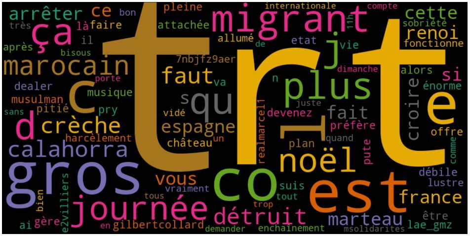

The task leader for this task was Wajeeha Imtiaz.

## Model Experimentation and Improvement

Model experimentation and improvement, quite expectedly, was the most time-consuming of all the chapter's tasks. Several contributions were made to test different language architectures and choose the on that was most suitable for the project's needs. These were coordinated by the task leader, Wajeeha Imtiaz.

The table below provides an overview of all tested architectures which were eventually not chosen for out classifier:

 | Contibutor | Model  | Type  | Additional Info | 
 |-|-|-|-|
 |Lamia SEKKAI  |Distil_BERT |TRansformers |Hyper parameters fine tuning of Base model provided by Alexander Lang|
 |Lamia Model |FastText Word Embedding- RNN Model |Deep learning  | |
 | | | | |
 | | | | |
 | | | | |
 | | | | |
 | | | | |
 
 ### The Selected Model

The model chosen for our classifier was the one developed by Chukwudi Okereafor. Okereafor fine-tuned [DistilBert](https://huggingface.co/docs/transformers/model_doc/distilbert) for our multi-class text classification problem using the Twitter dataset. 

Fine-tuning in the HuggingFace's `transformers` library involves using a pre-trained model and a tokenizer that is compatible with that model's architecture and input requirements. Each pre-trained model in transformers can be accessed using the right model class and be used with the associated tokenizer class. Since we needed DistilBert for a classification task, Okereafor chose the `DistilBertTokenizer`'s tokenizer class to tokenize our texts and then used `TFDistilBertForSequenceClassification` model class in a later section to fine-tune the pre-trained model using the output from the tokenizer.

The `DistilBertTokenizer` generates input_ids and attention_mask as outputs. This is what is required by a DistilBert model as its inputs. Therefore, Okereafor defined the tokenizer object using the `from_pretrained()` method which downloads and caches the tokenizer files associated with the DistilBert model. He used `padding` and `truncation` to make sure all the vectors were the same size.

Once the texts in an encoded form, there is one further step is needed before beginning the fine-tuning process: the conversion of the input encodings and labels into a TensorFlow Dataset object. Okereafor did this by passing them to the `from_tensor_slices` constructor method.

Okereafor chose to fine-tune Distilbert using two different methods, which are overviewed below.

### Fine-tuning using native Tensorflow

We use the from_pretrained() method to initialize a pre-trained model. This will load in the weights and initialize the model with the preset configurations.

The DistilBert model and other models available in the transformers library are standard tf.keras.Model classes (and torch.nn.Module in the case of Pytorch), and so we may use them just as we would use a model that we may have defined ourselves using the native TensorFlow and Keras API. Also, notice the num_labels=6 parameter, this is because we have a total of 5 classes.

It is also possible for us to customize the model by changing its configuration.
The data is prepared and the model is defined. Let's begin training!

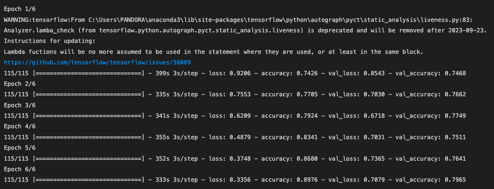

After 3 epochs we get an accuracy of 0.79 and a val_accuracy of 0.72. Not bad!

The model is fine-tuned and evaluated using the `train_dataset` and `val_dataset` that we created earlier. The `shuffle()` method shuffles the elements of the dataset, and `batch()` creates batches with batch_size of 16. 

Now our model is fine-tuned and is ready to be saved and used to make predictions on new data. 
The next section, however, discusses using the provided TFTrainer class, which is an alternative method to fine-tune a model in transformers.

### Fine-tuning using the TFTrainer class

The `TFTrainer` (Trainer for Pytorch) is a class provided by the transformers library that offers a simple, yet feature-rich, method of training and evaluating models.

The following code shows how to define the configuration settings and build a model using the TFTrainer class.

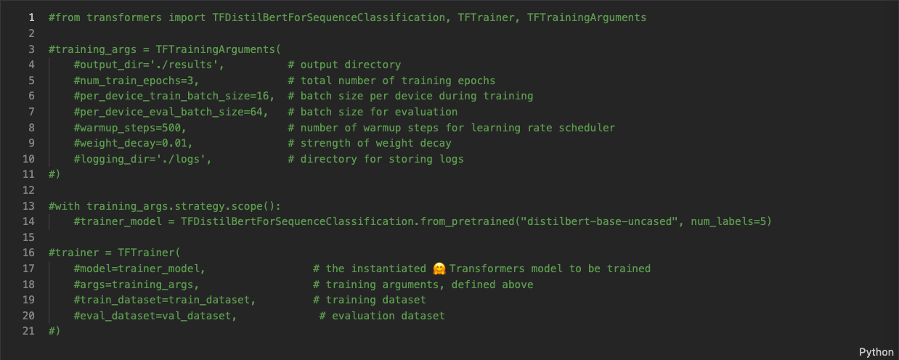

The `TFTrainingArguments` is how we set customization arguments for the training loop and later use them in the `TFTrainer` class. We instantiate the model using the `TFDistilBertForSequenceClassification` class. And then finally, we build the model by instantiating the TFTrainer class and passing in the different options we have defined along with our datasets.

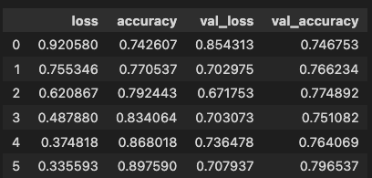

A visualisation of model loss and accuracy can be seen below:

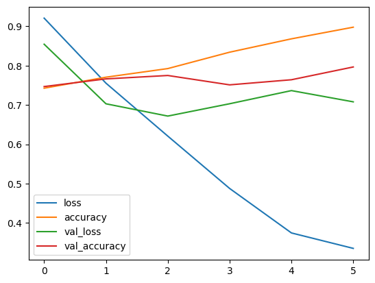

When testing the fine-tuned models to make predictions about new data, Chukwudi demonstrated that both models yielded identical results, and 89% accuracy.

## Model Deployment

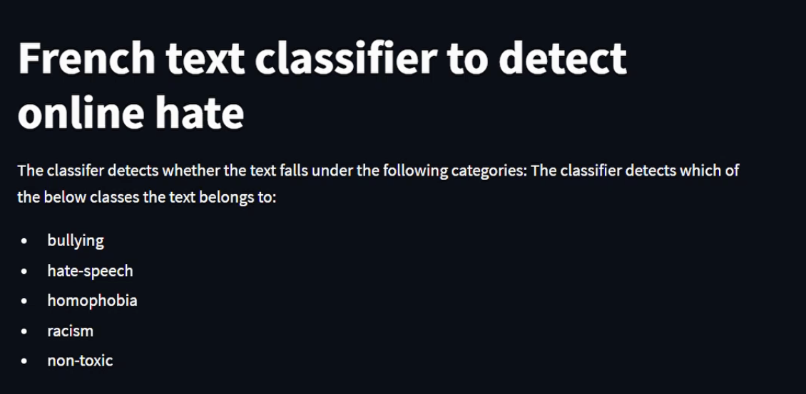

During the last two weeks of the project, the chapter leader Alexandre Iang worked on the deployment of a POC of the model in [Streamlit](https://streamlit.io/).

A POC, or proof of concept, is an experiment intended to show that a program, product, or system can be successfully deployed in the real world. Streamlit, on the other hand, is an open-source app framework for Machine Learning and Data Science. It helps create and publish web apps in a short time. It is compatible with major Python libraries such as scikit-learn, Keras, PyTorch, SymPy(latex), NumPy, pandas, Matplotlib etc., and it does not require any front-end experience.

The POC for this project is quite simple and has the form of an interface that prompts a sentence in French from the user, and then classifies it using our ML model. Below is an example of 'hate speech' prompt, and its correct classification:

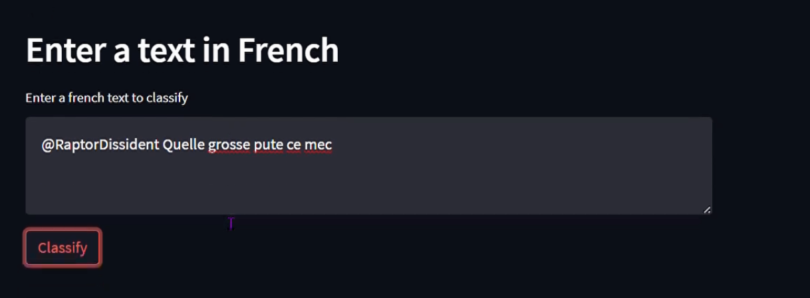
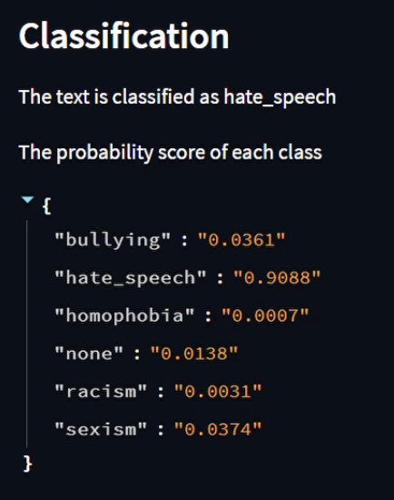

As illustrated in the image above, the application provides not only a classification for the sentence, but also the probabilities that the sentence has to belong to all considered classes. As was our goal, also non toxicity is correctly detected, as illustrated by the sentence below and its classification.

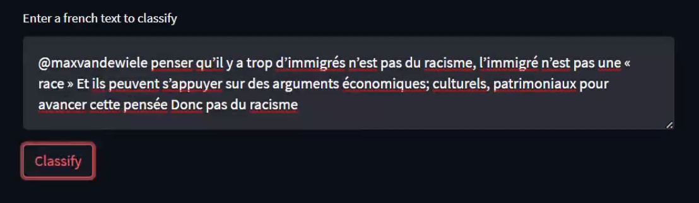
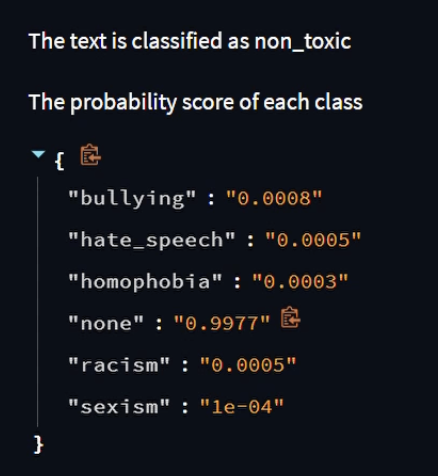

Please note that all images in this sections are from a demo graciously provided by our collaborator Divya Muthu Krishnan.

# Conclusions

Despite the successful implementation of our model during this chapter, further work can be forecasted to improve both the model and the way the model is deployed. The team are now planning a follow-up chapter in which a custom extension that will predict the content of a text in real time will be created, and subsequently deployed within an EC2 instance on Amazon Web Services (AWS).

____________________________________________________

This report was written by Caterina Bonan, Postdoctoral Researcher at the University of Cambridge, who takes full responsibity for any mistake or unaccuracy in it.

____________________________________________________

# References

[1] Sørensen, 2015

[2] Greijer et al., 2016

[3] Juusola et al., 2021

[4] [https://racismnoway.com.au/about-racism/cyber-racism/](https://racismnoway.com.au/about-racism/cyber-racism/)

[5] [https://www.sciencedirect.com/science/article/pii/S0747563221000509](https://www.sciencedirect.com/science/article/pii/S0747563221000509)

[6] [https://www.un.org/en/hate-speech/understanding-hate-speech/what-is-hate-speech](https://www.un.org/en/hate-speech/understanding-hate-speech/what-is-hate-speech)

[7] [https://www.apa.org/topics/bullying](https://www.apa.org/topics/bullying)

[8] [https://en.wikipedia.org/wiki/Exploratory_data_analysis](https://en.wikipedia.org/wiki/Exploratory_data_analysis)

___________________________________________

### Participants (in alphabetical order)

Alexandre Iang (chapter leader)

Amine Teffal

Caterina Bonan

Chukwudi Okereafor

Divya Muthu Krishnan

Haider Ali Khan

Hassan Outlaouait

Lamia Sekkai

Mohamed Kandil

Romy Sayah

Rukshar Alam

Vedanth Baliga
