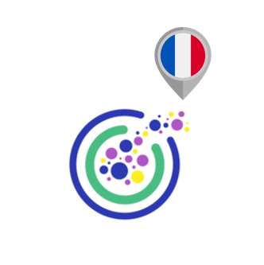

# FINAL REPORT: Deploying an Accurate Classifier to Stop Online Violence Against Children using NLP.

## A project by the Omdena Marseille Local Chapter.

_____________________________________________

# Executive Summary

# Introduction

This challenge was created to deploy an accurate classifier to identify grooming behavior in online chats with children. Its main aim was to stop online violence against children. The challenge, which united an international team of AI engineers over 8-weeks, was led by chapter lead Alexandre Iang. 

The common language for the chapter was English, although all chapter work was done on French data. Most engineers had at least a working knowledge of French.

## Problem Statement

The project was designed to reduce Online Sexual Exploitation and Abuse of Children (OSEAC). With a 15,000% rise in online Child Sexual Abuse Materials (CSAM) online from 2005 to 2020, it is clear that online child violence is growing exponentially. In 2021, the National Center for Missing and Exploited Children’s CyberTipline received 29.3 million reports of CSAM, making 2021 the worst year on record for online child sexual abuse.

Online grooming is the primary way that adults with a sexual interest in children or those who wish to harm them utilise to approach their preys ([1], [2]).

“Grooming is a multidimensional phenomenon in which an adult aims to solicit a child into a seemingly voluntary interaction with the intention of sexually abusing that child.” In a study Save the Children published last year, Grooming in the Eyes of a Child ([3]), we found that children who are the object of grooming often do not realize what is happening so they do not recognize they are in danger until they are being extorted into providing increasingly harmful imagery or even to meeting an online predator in person.

### Previous Related Work on the Topic

In 2020, Save the Children US collaborated with Omdena to address online violence. Of the various products that were generated from the sprint, the most promising was a classifier algorithm using Natural Language Programming to identify online grooming combined with a chatbot that can warn the children that they may be chatting with a groomer. Since then, a team of three engineers associated with the original project has continued to refine the technology. The core team now wants to expand on the work to build an industry usable solution at scale.

From the original challenge, the team has a large dataset of more than 800,000 lines taken from the Perverted Justice project, a project from 2003 to 2019 that used online volunteers as decoys to entrap predators that sought to contact minors to obtain sexual images or videos from them or to meet them in person. During the challenge and afterward, the team tagged much of the training data with labels, such as male or female, predator or victim, and level of risk of the conversation, but the data still requires extensive processing, and in particular, the team need to improve and systematize the way judge and annotate the level of risk. In addition to the data already have, the team is actively attempting to obtain additional databases of online grooming chats from a variety of sources, such as law enforcement agencies.

## Project Goals

The team goal was to stop online violence against children by deploying an accurate classifier to identify grooming behavior in online chats with children. Once suspicion of grooming reaches a threshold based on its similarity to the training data, it will trigger an action, which may differ depending on the platform it is deployed on and the objectives of the intervention. As an example, the team may warn the child through the chatbot without alerting the groomer, call a moderator, or shut down the chat entirely.

# Our Solution

For this challenge, we decided to collect additional data on hate speech from the Internet, classify them using five labels related to the field of 'hate', and then clean the data and use it to fine-tune a pre-existing language model.

## Domain Research

The first days of the project were dedicated to the onboarding, and to the definition of the materials to be used by the engineers to acquire domain knowledge.

At this early stage, different classes of hate were identified. Five among the most important classes of hate were defined as followed:

- *Sexism*: Refers to acts of violence that: 1) occur or linger in cyberspace; 2) are sexist, or sexual in nature; and 3) who reiterates dominant gender norms targeting girls and boys (tarnishing the former’s reputation and threatening the latter’s masculinity);

- *Racism*: Cyber racism  is  most  commonly  defined   as  racism  which   occurs  in   the  cyber world. This   includes   racism   which   occurs   on   the   internet   such   as   racist   websites, images, blogs, videos and online comments as well as racist comments, images or language in text messages, emails or on social networking sites. It can be defined more broadly as any use of information and communication technologies to   transmit   racist   attitudes   and   behaviour   including   the   transfer   of   racially offensive content that is intended to cause harm or distress to another person [4];

- *Homophobia*: Sexual   minorities   often   make   greater   use   of   the   internet   to   look   for   specific socialization environments in which they can meet other people with the same orientation or can avoid face-to-face social rejection and homophobic bullying. Paradoxically,   this   greater   use   of   the   internet  to   escape   offline   discrimination could lead to greater exposure to OSVR (Online Sexual Victimization and Risks). The   internet   is   an   environment   that   reproduces   societal   prejudices,   so   it   is reasonable   to   think   that   homophobia   and   discrimination   will   also   be   present online, causing higher rates of OSVR among sexual minorities. In turn, the higher rate of OSVR could partially explain the higher rate of negative mental health outcomes   found   among   sexual   minorities [5];

- *Hate speech*: In   common   language,   “hate   speech”   refers   to   offensive   discourse   targeting   a group or an individual based on inherent characteristics (such as race, religion or gender) and that may threaten social peace. To   provide   a   unified   framework   for   the   United   Nations   to   address   the   issue globally, the UN Strategy and Plan of Action on Hate Speech defines hate speech as...“any kind of communication in speech, writing or behaviour, that attacks or uses pejorative or discriminatory language with reference to a person or a group on the basis of who they are, in other words, based on their religion, ethnicity, nationality, race, colour, descent, gender or other identity factor.” [6];

- *Bullying*: Bullying is a form of aggressive behavior in which someone intentionally and  repeatedly causes another person injury or discomfort. Bullying can take the form of physical contact, words, or more subtle actions. The bullied individual typically  has trouble defending him or herself and does nothing to “cause” the bullying. Cyberbullying is verbally threatening or harassing behavior conducted through such   electronic   technology   as   cell   phones,   email,   social   media,   or   text messaging. Cyberbullying is verbally threatening or harassing behavior conducted through such   electronic   technology   as   cell   phones,   email,   social   media,   or   text messaging [7].

The five classes above were used to determine which data to collect and later, as labels for data annotation.

## Dataset Creation

The purpose of this task was to collect a dataset of hate speech in French language from various social media networks. The collected data was subsequently used to develop an artificial intelligence (AI) algorithm to detect hate speech on social media.

### Data Collection

The data collection method used in this task is web scraping, a cost-effective and efficient way to collect data from social media networks. This method involves automatically extracting data from websites using python code and/or no-code tools.

The final dataset contained a total of XXXX sentences.

### Data Annotation

All sentences were manually annotated using the categories of hate defined above: SEXISM, RACISM, HOMOPHOBIA, HATE SPEECH, BULLYING.

The task leader for this task was Mohamed Khandil.

## Exploratory Data Analysis (EDA)

The task leader for this task was Mohamed Khandil.

## Model Experimentation and Improvement

## Model Deployment

# Conclusions

Despite the successful implementation of our model during this chapter, further work can be forecasted to improve both the model and the way the model is deployed. The team are now planning a follow-up chapter in which a custom extension that will predict the content of a text in real time will be created, and subsequently deployed within an EC2 instance on Amazon Web Services (AWS).

# References

[1] Sørensen, 2015

[2] Greijer et al., 2016

[3] Juusola et al., 2021

[4] [https://racismnoway.com.au/about-racism/cyber-racism/](https://racismnoway.com.au/about-racism/cyber-racism/)

[5] [https://www.sciencedirect.com/science/article/pii/S0747563221000509](https://www.sciencedirect.com/science/article/pii/S0747563221000509)

[6] [https://www.un.org/en/hate-speech/understanding-hate-speech/what-is-hate-speech](https://www.un.org/en/hate-speech/understanding-hate-speech/what-is-hate-speech)

[7] [https://www.apa.org/topics/bullying](https://www.apa.org/topics/bullying)

___________________________________________

### Participants (in alphabetical order)

